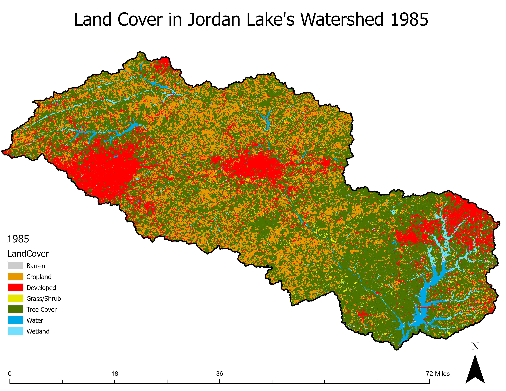
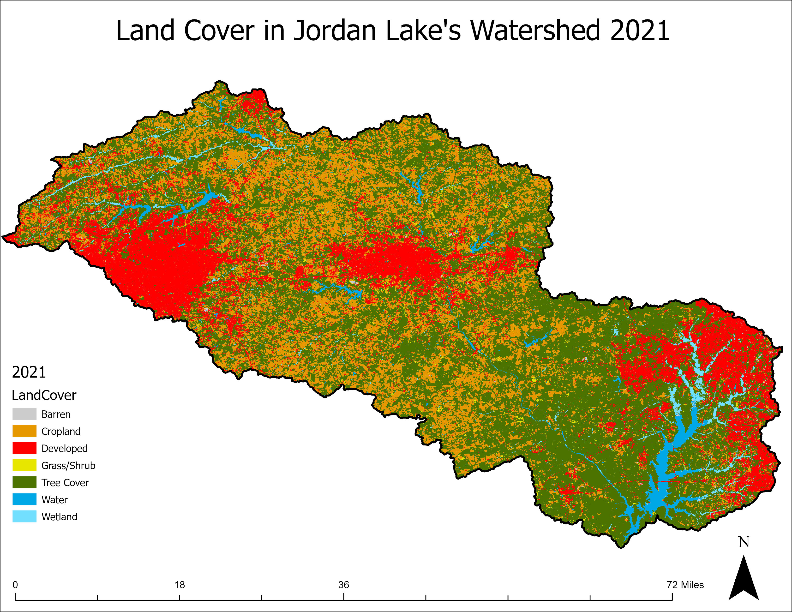

+++
date = '2024-11-16T14:29:41-03:00'
draft = false
title = 'Haw River Sample'
+++

## A Case Study: Jordan Lake and the Haw River

Jordan Lake is an artificial reservoir dammed in the early 80s as flood control for Fort Liberty. In the decades since, it has taken on a more vital role for local communities-as a recreational site and as a water source for Cary, NC. Jordan lake is primary fed (~80% of inflows) by the Haw River. 

**Land Use Changes**

The land use of Jodan Lake's watershed has also shifted in those years. Local communities have grown significantly at the expense of forested land cover-particularly on the lake's eastern margins. A dynamic, urbanized watershed like this will allow me to examine both short-term drivers of microplastic spatiotemporal variation, and the longer-term variations driven by chnages in the watershed.

**Microplastics**

A preliminary sample (3L) collected on October 31st from the Haw River at Bynum shows microplastic concentrations are ~9 particles/L.